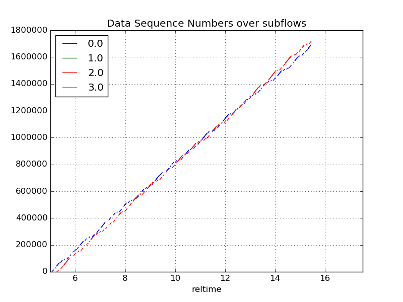

Presentation 
===

Mptcpanalyzer is a python tool conceived to help with MPTCP pcap analysis (as [mptcptrace] for instance). 

It accepts as input a capture file (\*.pcap) and from there generates a CSV file 
(via a call to tshark, the terminal version of wireshark) with MPTCP fields for external processing.
From there you can:

- list the MPTCP connections in the pcap
- display some statistics on a specific MPTCP connection (list of subflows etc...)
It accepts as input a capture file (\*.pcap) and depending on from there can :
- generate a CSV file with MPTCP fields
- plot data sequence numbers for all subflows
- plot DSN interarrival times
- See [Features](#Features) for more

Most commands are self documented and/or with autocompletion.

Then you have an interpreter with autocompletion that can generate & display plots such as the following:

You can reference mptcpanalyzer via the following Digital Object Identifier 

# How to install ?

First of all you will need a wireshark version that supports MPTCP dissection. 

Once wireshark is installed you can install mptcpanalyzer via pip:

`$ python3.5 -mpip install mptcpanalyzer`

python3.5+ is mandatory since we rely on its type hinting features.
Dependancies are (some will be made optional in the future):

- [stevedore](http://docs.openstack.org/developer/stevedore/) to handle the
  plugins architecture
- the data analysis library [pandas](http://pandas.pydata.org/) >= 0.17.1
- lnumexpr to run specific queries in pandas
- [matplotlib](http://matplotlib) to plot graphs

# License
Though it might be tempting to release under the CRAPL licence (http://matt.might.net/articles/crapl/), mptcpanalyzer is shamelessly released under the GPLv3 license.

# How to use ?

This package installs 3 programs:
- *mptcpexporter* can export a pcap into csv (exporting to sql should be easy).
Run `mptcpexporter -h` to see how it works.
- *mptcpnumerics* to generate some values (required buffer, etc...) depending on
  a json file describing the setup (MSS, forward/backward OWD, send buffer size
  etc...)
- *mptcpanalyzer* to get details on a loaded pcap. mptcpanalyzer can run into 3 modes:
  1. interactive mode (default): an interpreter with some basic completion will accept your commands. There is also some help embedded.
  2. if a filename is passed as argument, it will load commands from this file
  3. otherwise, it will consider the unknow arguments as one command, the same that could be used interactively

For example, we can load an mptcp pcap (I made one available on [wireshark wiki]
(https://wiki.wireshark.org/SampleCaptures#MPTCP) or in this repository, in the _examples_ folder).

Run  `$ mptcpanalyzer examples/iperf-mptcp-0-0.pcap`. The script will try to generate
a csv file, it can take a few minutes depending on your computer.
Then you have a command line: you can type `?` to list available commands. You have for instance:
- `lc` (list connections)
- `ls` (list subflows)
- `plot` 
- ...

`help ls` will return the syntax of the command, i.e. `ls [mptcp.stream]` where mptcp.stream is one of the number appearing 
in `lc` output.

It expects a trace to work with. If the trace has the form *XXX.pcap* extension, the script will look for its csv counterpart *XXX.pcap.csv*. The program will tell you what arguments are needed. Then you can open the generated graphs.

# How does it work (internals) ?
mptcpanalyzer consists of small python scripts. the heavy task is done by wireshark.
It relies on tshark (terminal version of wireshark) to convert pcap to csv files.

It accepts as input a pcap (or csv file following a proper format). 
Upon pcap detection, mptcpanalyzer the formats supported by tshark (terminal version of wireshark).

# How to add new plots ? new commands ?

mptcpanalyzer supports plugins, see CONTRIBUTING.md to learn how to add new
plots, commands, etc...

# Features

mptcpanalyzer is XDG compliant and will try to load your configuration from:
`$XDG_CONFIG_HOME/mptcpanalyzer/config` 

Other then that:
* caching mechanism: mptcpanalyzer compares your pcap creation time and will
  regenerate the cache if it exists in `$XDG_CACHE_HOME/mptcpanalyzer/<path_to_the_file>`
* support 3rd party plugins (be it plots or commands)

# FAQ

1. What if I have several versions of wireshark installed ?
Copy the config.example in the repository in `$XDG_CONFIG_HOME/mptcpanalyzer/config` and set
the *tshark_binary* value to the full path towards the tshark version that supports mptcp dissection.

# Similar tools

If I have forgotten about your tool, file an issue, for know we are aware of:
[mptcptrace](https://bitbucket.org/bhesmans/mptcptrace) with some examples [here](http://blog.multipath-tcp.org/blog/html/2015/02/02/mptcptrace_demo.html)

[mptcptrace]: https://bitbucket.org/bhesmans/mptcptrace
